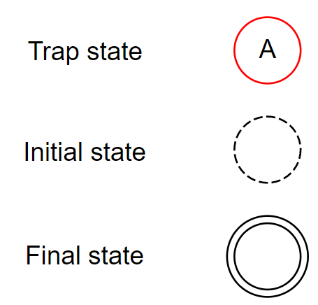

# Лабораторная работа №5 - PDA
## Участники
- Пашкевич Денис [@alien-agent](github.com/alien-agent)
- Сайкин Антон [@kekega](github.com/kekega)
- Стафиефский Стас [@stasstaf](github.com/stasstaf)

## Установка
Требуется Go 1.19, но скорее всего будет работать и на более ранних версиях.
```shell
git clone github.com/alien-agent/final-battle
cd final-battle
go build
```

## Параметры запуска
Программа по-умолчанию отрисовывает PDA в формате DOT, и сохраняет 
результат в файл **pda.dot** в одной папке с программой.

Поддерживаются следующие параметры командной строки:
<pre>
-m, --mode=[stdin|file] режим работы программы (чтение из входного потока или файла)
    --pda-filename      путь до файла с описанием PDA
    --language-filename путь до файла с параметрами грамматики (опционально)
    --words-filename    путь до файла со словами для обработки (обязательно для mode=="file")
</pre>
В случае использования флага `--language-filename`, в каждой строке файла настройки
указываются имя и значение параметра грамматики через пробел. См. пример.

## Примеры
### Описание PDA
<pre>
States -> {q0, q1}
FinalStates -> {q0}
InputAlphabet -> {(, )}
StackAlphabet -> Z0, B
InitialState -> q0
InitialStackSymbol -> Z0
Transition -> q0 / q1 / ( / Z0 / B, Z0
Transition -> q1 / q1 / ( / B / B, B
Transition -> q1 / q1 / ) / B /
Transition -> q1 / q0 / ε / Z0 / Z0
</pre>
### Параметризация грамматики (default value)
```
Arrow ->
Delimiter ,
TransitionDelimiter /
UniversalQuantifier ∀
Epsilon ε
```

### Грамматика

Стартовый нетерминал: [PDA]

```
[PDA] -> [STATES_STRING]'\n'[FINAL_STATES_STRING]'\n'[INPUT_ALPHABET_STRING]'\n'[STACK_ALPHABET_STRING]'\n'[INITIAL_STATE_STRING]'\n[INITIAL_STACK_SYMBOL_STRING]'\n'[TRANSITIONS_STRING]
[STATES_STRING] -> States [ARROW] [STATES]
[FINAL_STATES_STRING] -> FinalStates [ARROW] [STATES]
[INPUT_ALPHABET_STRING] -> InputAlphabet [ARROW] [INPUTS]
[STACK_ALPHABET_STRING] -> StackAlphabet [ARROW] [INPUTS]
[INITIAL_STATE_STRING] -> InitialState [ARROW] [ID]
[INITIAL_STACK_SYMBOL_STRING] -> InitialStackSymbol [ARROW] [ID]
[TRANSITIONS_STRING] -> [SINGLE_TRANSITION_STRING] | [SINGLE_TRANSITION_STRING]'\n'[TRANSITIONS_STRING]
[SINGLE_TRANSITION_STRING] -> Transition [ARROW] [FROM] [TRANSITION_DELIMETER] [TO] [TRANSITION_DELIMETER] [INPUT] [TRANSITION_DELIMETER] [POP] [TRANSITION_DELIMETER] [PUSH]
[FROM] -> [ID]
[TO] -> [ID]
[INPUT] -> [CHAR_EXTENDED]
[POP] -> [CHAR_EXTENDED]
[PUSH] -> [CHAR] | [CHAR][DELIMETER] [PUSH_NOT_EMPTY] | ε
[PUSH_NOT_EMPTY] -> [CHAR] | [CHAR][DELIMETER] [PUSH_NOT_EMPTY]
[STATES] -> [ID] | [ID][DELIMETER] [STATES]
[ID] -> [CHAR]+
[CHAR] -> [a-zA-z0-9]
[CHAR_EXTENDED] -> [CHAR] | [UniversalQuantifier] | [Epsilon]
[INPUTS] -> [CHAR_EXTENDED] | [CHAR_EXTENDED][DELIMETER] [INPUTS]
```

### Условные обозначения
Условные обозначения для графа, полученного в результате работы программы

